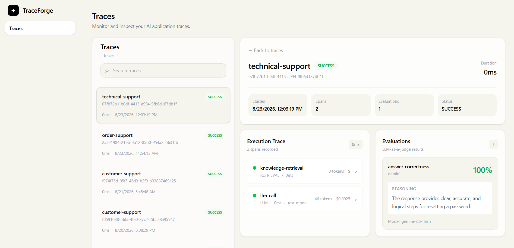
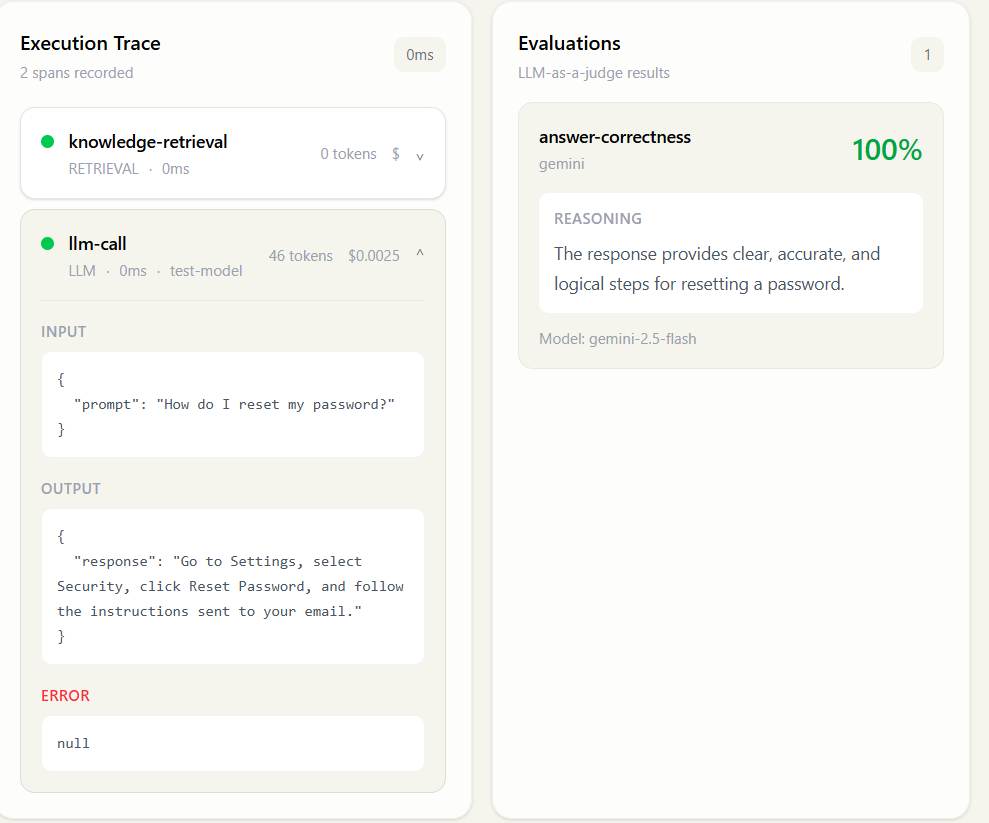
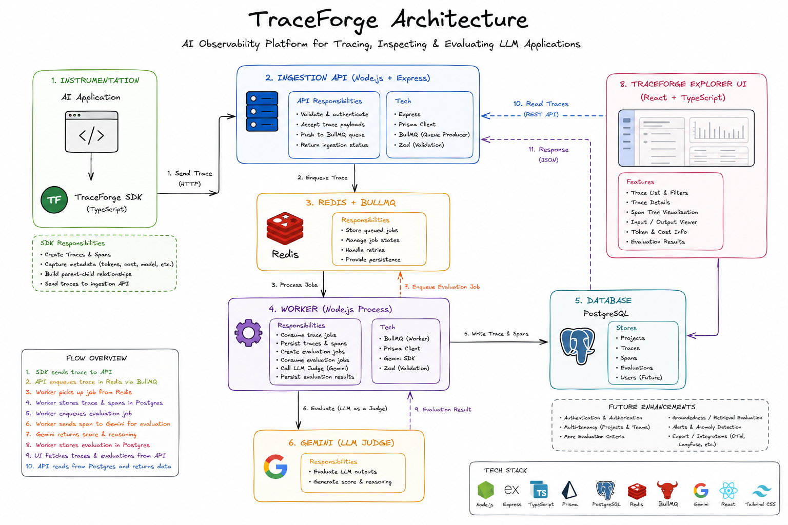

# TraceForge

> An open-source AI observability platform for tracing, inspecting, and evaluating LLM applications.

TraceForge helps developers understand what happens inside AI applications by capturing traces and hierarchical spans across LLM calls, retrieval, and agent workflows.

It provides a TypeScript SDK for instrumentation, asynchronous telemetry ingestion using Redis and BullMQ, PostgreSQL persistence, a trace explorer UI, and LLM-as-a-judge evaluations.

---

## Overview

Modern AI applications are rarely a single LLM call.

A typical request might look like:

```text
User Request
     │
     ▼
   Agent
     │
     ├── Retrieval
     │     └── Database / Vector Search
     │
     ├── Tool Call
     │
     └── LLM
           │
           ▼
       Final Answer
```

When something goes wrong, developers need to understand:

- What did the user ask?
- What information was retrieved?
- Which tools were called?
- Which model generated the response?
- How many tokens were used?
- How much did the request cost?
- How long did each operation take?
- Was the final answer actually correct?

TraceForge captures this execution path as a structured trace.

## Screenshots

### Trace Explorer



### Trace Details



### Architectural Diagram



## Features

### Tracing

- TypeScript SDK for application instrumentation
- Trace creation and lifecycle management
- Hierarchical spans
- Parent-child span relationships
- Agent spans
- LLM spans
- Retrieval spans

### LLM Observability

- Model information
- Provider information
- Input tokens
- Output tokens
- Cost tracking
- Input/output payloads
- Span duration
- Error information

### Asynchronous Processing

- Redis-backed BullMQ queues
- Background trace ingestion
- Separate evaluation jobs
- Retryable background processing

### Evaluations

- LLM-as-a-judge
- Automated answer correctness evaluation
- Evaluation score
- Evaluation reasoning
- Evaluation persistence

### Trace Explorer

- Trace list
- Trace status
- Trace duration
- Nested span visualization
- Expandable span details
- LLM metadata
- Input/output inspection
- Evaluation results
- Responsive UI

## Architecture

```text
                         AI Application
                              │
                              ▼
                    @traceforge/sdk
                              │
                              │ HTTP
                              ▼
                       Ingestion API
                              │
                              ▼
                        Redis / BullMQ
                              │
                              ▼
                           Worker
                       ┌──────┴──────┐
                       │             │
                    Ingest        Evaluate
                       │             │
                       ▼             ▼
                  PostgreSQL      Gemini
                       │             │
                       └──────┬──────┘
                              │
                              ▼
                         REST API
                              │
                              ▼
                       TraceForge Web
```

## Data Flow

### 1. Application instrumentation

An application uses the TraceForge SDK:

```ts
const trace = traceforge.startTrace("customer-support");

const llm = trace.startSpan("llm-call", "LLM");

llm.end({
  input: {
    prompt: "What is the refund policy?",
  },

  output: {
    response: "Customers can request a refund within 30 days.",
  },

  model: "test-model",
  provider: "test-provider",

  inputTokens: 20,
  outputTokens: 12,

  cost: 0.002,
});

await trace.end();
```

The SDK sends the completed trace to the ingestion API.

### 2. Asynchronous ingestion

The ingestion API does not perform all database work synchronously.

Instead:

```text
SDK
 │
 ▼
API
 │
 ▼
Redis
 │
 ▼
BullMQ Job
 │
 ▼
Worker
 │
 ▼
PostgreSQL
```

This keeps telemetry processing separate from the application's request path.

### 3. Evaluation

After a trace has been persisted, the worker creates an evaluation job.

```text
Trace
  │
  ▼
Find final LLM span
  │
  ├── Input
  └── Output
        │
        ▼
   Gemini Judge
        │
        ▼
   Score + Reason
        │
        ▼
   PostgreSQL
```

The evaluation result is associated with the trace and the evaluated LLM span.

## Trace and Span Model

A trace represents one complete execution.

A trace can contain multiple spans.

For example:

```text
customer-support
│
└── Agent
    │
    ├── Retrieval
    │
    └── LLM
```

More complex workflows can be represented as:

```text
Agent
│
├── Retrieval
│   └── Database Query
│
├── Tool Call
│
└── LLM
    └── Tool Call
```

Each span contains its own metadata and can reference a parent span through `parentSpanId`.

The web application reconstructs this relationship into a tree for visualization.

## SDK

The TraceForge SDK provides a simple API for instrumenting applications.

```ts
import { TraceForge } from "@traceforge/sdk";

const traceforge = new TraceForge({
  apiKey: process.env.TRACEFORGE_API_KEY!,
  endpoint: process.env.TRACEFORGE_ENDPOINT!,
});

const trace = traceforge.startTrace("customer-support");

const retrieval = trace.startSpan("document-retrieval", "RETRIEVAL");

retrieval.end({
  input: {
    query: "What is the refund policy?",
  },

  output: {
    documents: ["refund-policy.pdf"],
  },
});

const llm = trace.startSpan("llm-call", "LLM");

llm.end({
  input: {
    prompt: "What is the refund policy?",
  },

  output: {
    response: "Customers can request a refund within 30 days.",
  },

  model: "test-model",
  provider: "test-provider",

  inputTokens: 20,
  outputTokens: 12,

  cost: 0.002,
});

await trace.end();
```

## LLM-as-a-Judge

TraceForge supports automated evaluation of LLM responses.

For the initial implementation, the final LLM span is evaluated using Gemini.

The evaluator receives:

```text
Input
+
LLM Output
+
Evaluation Criteria
```

For example:

```text
Input:
What is the refund policy?

Output:
Customers can request a refund within 30 days.

Criteria:
Evaluate the correctness of the answer.
```

The judge produces a structured result:

```json
{
  "score": 0.94,
  "reason": "The response correctly answers the user's question."
}
```

This result is persisted as an Evaluation.

## Evaluation Data Model

An evaluation is associated with a trace and optionally with a specific span.

Conceptually:

```text
Trace
│
├── Span
│
├── Span
│
└── Evaluation
      │
      ├── Score
      ├── Reason
      ├── Provider
      └── Model
```

This allows the UI to display evaluation results alongside the execution trace.

## Web Interface

The TraceForge web application provides a trace exploration interface.

### Trace List

Displays:

- Trace name
- Status
- Duration
- Timestamp
- Trace ID

### Trace Details

Displays:

- Trace metadata
- Total span count
- Evaluation count
- Execution duration

### Span Tree

Displays:

- Span hierarchy
- Span type
- Span status
- Duration
- Model
- Token usage
- Cost

Spans can be expanded to inspect:

- Input
- Output
- Errors

### Evaluations

Displays:

- Evaluation name
- Score
- Judge provider
- Judge model
- Evaluation reasoning

## Tech Stack

### Frontend

- React
- TypeScript
- Vite
- Tailwind CSS

### Backend

- Node.js
- TypeScript
- Express
- Prisma
- PostgreSQL

### Background Processing

- Redis
- BullMQ

### SDK

- TypeScript
- pnpm workspaces

### AI Evaluation

- Google Gemini

## Project Structure

```text
traceforge/
│
├── apps/
│   │
│   ├── api/
│   │   └── src/
│   │
│   ├── worker/
│   │   └── src/
│   │
│   ├── web/
│   │   └── src/
│   │
│   └── sdk-test/
│
├── packages/
│   │
│   ├── sdk/
│   │   └── src/
│   │
│   └── shared/
│
├── prisma/
│
├── package.json
├── pnpm-workspace.yaml
└── README.md
```

## Getting Started

### Prerequisites

You will need:

- Node.js
- pnpm
- PostgreSQL
- Redis
- Google Gemini API key

### Installation

Clone the repository and install dependencies:

```bash
pnpm install
```

### Environment Variables

**API**

```env
DATABASE_URL=your_postgresql_connection_string
REDIS_URL=your_redis_connection_string
```

**Worker**

```env
DATABASE_URL=your_postgresql_connection_string
REDIS_URL=your_redis_connection_string
GEMINI_API_KEY=your_gemini_api_key
```

**SDK Test**

```env
TRACEFORGE_API_KEY=your_traceforge_api_key
TRACEFORGE_ENDPOINT=http://localhost:8000
```

Never commit real API keys or secrets to the repository.

### Database

Go to api:

```bash
cd apps/api
```

Run Prisma migrations:

```bash
pnpm prisma migrate dev
```

Generate Prisma Client:

```bash
pnpm prisma generate
```

### Running the Application

Start the API:

```bash
pnpm --filter @traceforge/api dev
```

Start the worker:

```bash
pnpm --filter @traceforge/worker dev
```

Start the web application:

```bash
pnpm --filter web dev
```

Run the SDK test application:

```bash
pnpm --filter sdk-test dev
```

The exact commands may vary depending on the scripts defined in each workspace package.

## Example Trace

A simple application can produce:

```text
Trace: customer-support
│
├── Retrieval
│   ├── Query
│   └── Documents
│
└── LLM
    ├── Model: test-model
    ├── Input Tokens: 20
    ├── Output Tokens: 12
    └── Cost: $0.002
```

The trace can then be inspected in the TraceForge UI.

## Design Decisions

### Why Redis + BullMQ?

Telemetry should not require the application to wait for database persistence.

Using a queue provides:

- Asynchronous processing
- Retry support
- Job isolation
- Worker scalability
- Separation between ingestion and persistence

The API is responsible for accepting telemetry while workers perform the heavier processing.

### Why PostgreSQL?

TraceForge uses PostgreSQL because the data has strong relationships:

```text
Project
   │
   └── Trace
        │
        ├── Span
        │    └── child Span
        │
        └── Evaluation
```

PostgreSQL provides:

- Relational integrity
- Indexing
- Foreign keys
- Structured querying
- Reliable persistence

### Why asynchronous evaluation?

LLM evaluation can be slower and more expensive than normal database operations.

Instead of blocking trace ingestion:

```text
API
 │
 ├── Save telemetry
 │
 └── Return
```

TraceForge schedules evaluation asynchronously:

```text
Trace persisted
      │
      ▼
Evaluation Job
      │
      ▼
Judge LLM
      │
      ▼
Evaluation stored
```

This keeps the ingestion path lightweight.

## Development Roadmap

### Completed

- Monorepo setup
- Shared package
- TypeScript SDK
- Trace creation
- Span creation
- Nested spans
- Trace ingestion API
- Redis integration
- BullMQ integration
- Worker
- PostgreSQL persistence
- Prisma models
- Trace API
- Trace detail API
- Trace Explorer UI
- Nested span visualization
- Span input/output inspection
- Token tracking
- Cost tracking
- LLM-as-a-judge
- Gemini integration
- Evaluation persistence
- Evaluation API
- Responsive UI

### Future

- Batch telemetry ingestion
- Evaluation history
- Multiple evaluation criteria
- Groundedness evaluation
- Retrieval quality evaluation
- Evaluation trends
- Authentication
- Multiple projects
- Production deployment
- More LLM providers
- OpenTelemetry compatibility

## What I Learned Building TraceForge

TraceForge was built to explore the engineering problems involved in AI observability systems, including:

- Designing an SDK for telemetry collection
- Modeling hierarchical traces and spans
- Building asynchronous ingestion pipelines
- Using Redis and BullMQ for background processing
- Designing relational schemas for telemetry
- Handling parent-child span relationships
- Tracking LLM token usage and cost
- Running asynchronous LLM evaluations
- Building a trace visualization interface
- Separating ingestion, processing, evaluation, and presentation layers

## License

MIT
